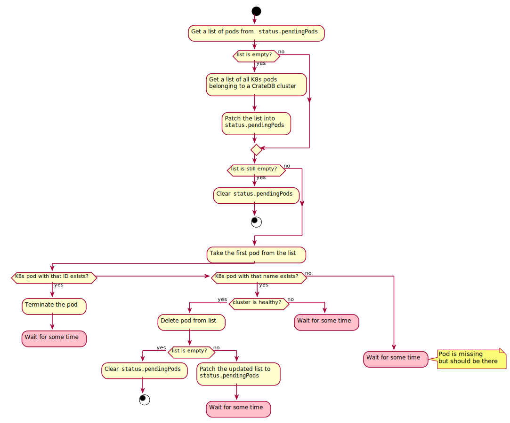

Concepts
========

.. _concept-bootstrapping:

Bootstrapping
-------------

As part of the cluster management, the CrateDB Kubernetes Operator requires a
CrateDB user named ``system`` with ``ALL`` privileges. The user will be created
automatically upon creation of a new cluster. For that, the CrateDB Kubernetes
Operator will use Kubernetes' ``exec`` feature to run the bundled ``crash``
command inside one of the eligible master nodes. The user creation will fail
gracefully if the ``system`` user already exists (for whatever reason).
Additionally, the user will receive the ``ALL`` privileges, so they can then do
anything in the cluster.

A user may specify a license in ``spec.cluster.license`` which should be loaded
into the cluster. Since a cluster may be started with more nodes than allowed
by the free license, the CrateDB Kubernetes Operator will attempt to set the
license *before* trying to create the system user. Thus, license setting works
the same way as described above: by ``exec``\ing into a master node's crate
container and running ``crash``.

Finally, using the newly created ``system`` user, the CrateDB Kubernetes
Operator will create all users specified under ``spec.users`` with their
corresponding passwords and the ``ALL`` privileges. This it does by connecting
to the cluster using the PostgreSQL protocol, and *not* by ``exec``\ing into a
Kubernetes container.

The entire bootstrapping process may not take longer than (by default) 1800
seconds before it is considered failed. The timeout can be configured with the
:envvar:`BOOTSTRAP_TIMEOUT` environment variable.

User Passwords
~~~~~~~~~~~~~~

When creating the CrateDB users specified under ``.spec.users``, the operator
will add the ``operator.cloud.crate.io/user-password`` label to each of the
Kubernetes Secrets assigned to one of the users. To keep backward
compatibility, it also adds the label to Kubernetes Secrets referenced in
existing CrateDB resources :func:`on resume <kopf:kopf.on.resume>`.

The ``operator.cloud.crate.io/user-password`` label is used to filter the
events when watching for changes on one of the Kubernetes Secrets. If one of
the Kubernetes Secrets is updated, the operator will update all CrateDB users
that use that secret by iterating over all CrateDB resources. The operator
updates the password in a CrateDB cluster by logging in to one of the CrateDB
nodes with the corresponding username and old password. It will then use the
:ref:`cratedb:ref-alter-user` query to update the password.

.. note::

   If one changes the CrateDB user's password directly in CrateDB, the operator
   won't be able to update that user anymore.

Cluster Restart
---------------

Some situations, such as version upgrades, require a cluster restart. Usually a
rolling restart is sufficient. When instructed to do so, the CrateDB Kubernetes
Operator will perform a rolling cluster restart, following this process:

Whenever the process calls for "Wait for some time", a
:class:`kopf.TemporaryError` is raised, causing the Kopf sub-handler to be
rescheduled and re-executed. That allows for the sub-handler to be called
multiple times and allows for the operator to be restarted in the mean time, as
it continues where it left of.

Cluster Scaling
---------------

From time to time it can be necessary to scale a cluster. At such times, the
operator allows for scaling *existing* node definitions up and down. I.e., when
a cluster contains 3 master nodes - 4 data nodes with name "hot" and 10 data
nodes with name "cold" - each of them can be scaled up or down (with a minimum
of 3 master nodes) as one pleases.

The scaling operation will follow these four basic steps:

#. First, all master nodes will be scaled. Whether up or down doesn't matter.

   Since the master nodes do not have any data, scaling them is done fairly
   quickly. Getting this change out of the way first makes the rest of the
   process less complex.

#. Next, all node definitions that are scaled *up* will be handled.

   This ensures that even when there are tables with loads of replicas in the
   cluster, there is less risk of too few nodes occurring if you are also
   scaling *down* other nodes. It also means that the process of moving data to
   the new nodes will start already, so when nodes are removed in step 3, some
   of their data will already have been transferred.

#. Then the remaining node definitions that will be scaled *down* are taken
   care of.

   This step is a bit more complex than the previous ones: first the operator
   checks that none of the tables in the cluster use more replicas than there
   are nodes available in the cluster. This is to avoid underreplicated tables.

   Next, it will deallocate all shards from the nodes that will be turned off.
   Once the data has been moved, the corresponding nodes are turned off by
   decreasing the number of replicas in the Kubernetes StatefulSet.

#. The last step for the operator is to update all StatefulSets that make a
   CrateDB cluster to the expected total number of nodes. This ensures that if
   a pod dies, its restart won't alter CrateDB's expected number of nodes. This
   will also involve acknowledging all ``gateway.expected_nodes`` :ref:`node
   checks <cratedb:sys-node-checks>` (ID 1).

The entire scaling operation may not take longer than 3600 seconds by default,
or no longer than whatever is configured in the :envvar:`SCALING_TIMEOUT`
environment variable.

.. _concept-webhooks:

Webhooks
--------

Kubernetes follows an event-driven architecture. Depending on your use of the
operator, it can be beneficial to receive notifications of when certain events
occurred, such as a successful or failed cluster upgrade or scaling. By setting
the environment variables :envvar:`WEBHOOK_PASSWORD`, :envvar:`WEBHOOK_URL`,
and :envvar:`WEBHOOK_USERNAME` to non-empty values, the operator will send HTTP
POST requests to the provided URL. An example JSON payload is shown and
documented below.

.. important::

   The operator will *not* retry failed webhook notifications!

.. code-block:: json

   {
     "cluster": "my-new-crate-cluster",
     "event": "upgrade",
     "namespace": "my-crate-namespace",
     "scale_data": null,
     "status": "success",
     "upgrade_data": {
       "new_registry": "crate",
       "new_version": "4.1.6",
       "old_registry": "crate",
       "old_version": "4.1.5"
     },
   }

:``cluster``:
   The Kubernetes name (``.metadata.name``) of the ``cratedbs.cloud.crate.io``
   resource.

:``event``:
   Either ``'scale'`` or ``'upgrade'``.

:``namespace``:
   The Kubernetes namespace (``.metadata.namespace``) of the
   ``cratedbs.cloud.crate.io`` resource is deployed in.

:``scale_data``:
   When ``event`` is ``'scale'``, otherwise ``null``.:

   :``new_data_replicas``:
      An array of objects, where each object has a ``name`` and a ``replicas``
      key. The ``name`` corresponds to a node name
      (``.spec.nodes.data.*.name``), the ``replicas`` to the number of new
      replicas (``.spec.nodes.data.*.replicas``).

   :``new_master_replicas``:
      An optional number of replicas of new master nodes.

   :``old_data_replicas``:
      An array of objects, where each object has a ``name`` and a ``replicas``
      key. The ``name`` corresponds to a node name
      (``.spec.nodes.data.*.name``), the ``replicas`` to the number of old
      replicas (``.spec.nodes.data.*.replicas``).

   :``old_master_replicas``:
      An optional number of replicas of old master nodes.

:``status``:
   Either ``'failure'`` or ``'success'``.

:``upgrade_data``:
   When ``event`` is ``'upgrade'``, otherwise ``null``.:

   :``old_registry``:
      The old Docker image registry as defined in
      ``.spec.cluster.imageRegistry``.

   :``new_registry``:
      The new Docker image registry as defined in
      ``.spec.cluster.imageRegistry``.

   :``old_version``:
      The old image version (Docker tag) as defined in
      ``.spec.cluster.version``.

   :``new_version``:
      The new image version (Docker tag) as defined in
      ``.spec.cluster.version``.
