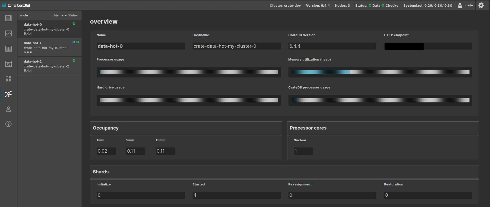

# CrateDB Operator — Red Hat OpenShift Partner Validation Report

> **Status:** ✅ Completed — all test cases (TC-01 – TC-09) passed on OpenShift 4.22.11.
> **Validation type:** Red Hat **Partner Validation** (self-attested)
>
> Legend: ✅ pass · ❌ fail · ➖ N/A

---

## 1. Report metadata

| Field                           | Value                                           |
| ------------------------------- | ----------------------------------------------- |
| Operator version under test     | `2.64.1`                                        |
| `crate-control` sidecar version | `2.64.1`                                        |
| CrateDB version tested          | `6.4.4`                                         |
| OpenShift version tested        | `4.22.11` (EUS)                                 |
| Installation method             | Helm (`crate-operator-crds` + `crate-operator`) |
| Report author                   | Thomas Achatz                                   |
| Date of execution               | 2026-09-10                                      |
| Overall result                  | ✅                                              |

### Support matrix

| OpenShift version | CrateDB version | Result | Notes                                        |
| ----------------- | --------------- | ------ | -------------------------------------------- |
| 4.22.11 (EUS)     | 6.4.4           | ✅     | Single committed version for this validation |

We commit to **one** OpenShift version for this validation: **4.22.11**, an
even-numbered Extended Update Support (EUS) release — the lifecycle enterprise
OpenShift customers standardize on. The operator supports OpenShift 4.12 and
later, so 4.22 is well within range. Additional versions can be added later with a
re-run.

---

## 2. Validation scope — in / out

Partner Validation is self-attested. We validate the OpenShift-specific install
path and the core cluster lifecycle on the committed version.

**In scope** (the 9 lifecycle scenarios, TC-01 – TC-09): operator install, cluster
deploy, scaling, pod recovery/rescheduling, persistent storage, operator upgrade,
OpenShift version compatibility, monitoring/observability, removal & cleanup.

**Out of scope** (operator features not exercised for this validation — they may
work, but are not attested here): SSL/TLS via Let's Encrypt; custom cluster/node
settings beyond the tested baseline; hot/cold storage tiers; users & secrets
management flows; master + data (non-"all-equal") topologies.

---

## 3. How the operator works on OpenShift (adaptations)

OpenShift enforces a stricter security posture than vanilla Kubernetes — the
restricted Security Context Constraint (SCC) and Pod Security Admission (PSA). The
operator detects this and adapts its behavior when
`CRATEDB_OPERATOR_CLOUD_PROVIDER=openshift` is set. These are deliberate design
choices, and each is exercised by a test case below.

| Adaptation                                              | Why OpenShift needs it                                                                                               | How the operator handles it                                                                                                                                                                                                                                                              | Validated by |
| ------------------------------------------------------- | -------------------------------------------------------------------------------------------------------------------- | ---------------------------------------------------------------------------------------------------------------------------------------------------------------------------------------------------------------------------------------------------------------------------------------- | ------------ |
| **`crate-control` sidecar for SQL execution**           | The restricted SCC does not permit `pod_exec`, which the operator normally uses to run SQL inside a pod              | Deploys a lightweight HTTP sidecar (port 5050) with an authenticated `/exec` endpoint (token in a per-cluster Secret). It replaces `pod_exec` for in-pod SQL such as system-user bootstrap and user/password management; routine operations such as health checks use direct connections | TC-02, TC-08 |
| **Per-cluster custom SCC** (`crate-anyuid-<ns>-<name>`) | The CrateDB entrypoint uses `chroot`, which requires starting as UID 0; the restricted SCC forbids this              | Creates one SCC per cluster granting `SYS_CHROOT` + `RunAsAny`, dropping `KILL`/`MKNOD`, **not** privileged; bound only to a dedicated per-cluster ServiceAccount — no cluster-wide grant                                                                                                | TC-02        |
| **Root → drop-privilege startup**                       | CrateDB must briefly run as root for `chroot`                                                                        | Pod security context `runAsUser: 0, fsGroup: 0`; after `chroot` the process drops to UID 1000. The root phase is limited to the entrypoint                                                                                                                                               | TC-02        |
| **No privileged init container**                        | The restricted SCC forbids the privileged `sysctl` init container                                                    | Init container skipped; kernel tuning is delegated to the cluster admin (Node Tuning Operator / MachineConfig)                                                                                                                                                                           | TC-01/TC-02  |
| **PVC `blockOwnerDeletion` disabled**                   | The StatefulSet controller lacks permission to set finalizers on PVCs in OpenShift                                   | Owner references on PVCs use `blockOwnerDeletion: false`                                                                                                                                                                                                                                 | TC-05, TC-09 |
| **Self-contained lifecycle**                            | Avoids external-fileserver lifecycle hooks; relies on CrateDB shard replication for availability during pod turnover | Runs without `postStart`/`preStop` hooks; availability during rolling updates is maintained through shard replicas                                                                                                                                                                       | TC-03/TC-04  |

**Availability model:** on OpenShift the operator relies on CrateDB shard replicas
(rather than a graceful-decommission hook) to maintain availability during rolling
updates and node maintenance. Deploy tables with `number_of_replicas >= 1` and
perform node maintenance in planned windows — standard practice for stateful
workloads on Kubernetes.

The full, maintained description of these adaptations (complete SCC spec,
kernel-tuning setup, PSA labelling, storage, troubleshooting) is published in the
CrateDB Operator documentation:
<https://crate-operator.readthedocs.io/en/latest/openshift.html>.

---

## 4. Test environment

| Field               | Value                                                                             |
| ------------------- | --------------------------------------------------------------------------------- |
| Cluster type        | OpenShift Container Platform 4.22.11 on Google Cloud                              |
| Cluster topology    | 3 control-plane + 3 workers, one worker per zone (3 zones)                        |
| Worker node size    | 4 vCPU / ~16 GiB each                                                             |
| StorageClass        | `ssd-csi` (CSI, `allowVolumeExpansion: true`, `WaitForFirstConsumer`) — zonal RWO |
| Kernel tuning       | None required — nodes provide `vm.max_map_count=262144` (CrateDB's minimum)       |
| Namespace PSA level | `pod-security.kubernetes.io/enforce=privileged`                                   |
| Operator image      | `crate/crate-operator:2.64.1`                                                     |
| Sidecar image       | `crate/crate-control:2.64.1`                                                      |
| Registry access     | Docker Hub (public)                                                               |

**Topology note:** workers are spread one-per-zone (mirroring a production
multi-AZ layout) and cloud persistent disks are **zonal** in RWO mode — a pod's
PVC can only re-attach in its own zone, and each zone has exactly one worker. This
shapes TC-04, where node drain is validated as a _resilience_ scenario rather than
a simple reschedule.

**Sizing note:** the test cluster uses a reduced per-node spec (`cpu: 1,
memory: 3Gi`) to fit the 4 vCPU workers. This is a functional validation, not a
sizing/performance benchmark. The operator places one data pod per node, so the 3
data nodes map to the 3 workers, one per zone.

**Environment snapshot (sanitized):**

```text
Server Version: 4.22.11        Kubernetes Version: v1.35.6

NAME              ROLES                  VERSION   OS-IMAGE
control-plane-0   control-plane,master   v1.35.6   RHEL CoreOS 9.8
control-plane-1   control-plane,master   v1.35.6   RHEL CoreOS 9.8
control-plane-2   control-plane,master   v1.35.6   RHEL CoreOS 9.8
worker-a          worker                 v1.35.6   RHEL CoreOS 9.8   (zone a)
worker-b          worker                 v1.35.6   RHEL CoreOS 9.8   (zone b)
worker-c          worker                 v1.35.6   RHEL CoreOS 9.8   (zone c)

STORAGECLASS   PROVISIONER   RECLAIM   BINDINGMODE            EXPANDABLE
ssd-csi        (CSI)         Delete    WaitForFirstConsumer   true
standard-csi   (CSI)         Delete    WaitForFirstConsumer   true (default)
```

### Environment prerequisites

These are operator requirements on OpenShift (documented in the [OpenShift support
guide](https://crate-operator.readthedocs.io/en/latest/openshift.html)), not test
steps — all were satisfied in this environment:

- OpenShift 4.12+ with cluster-admin available for install
- Kernel param `vm.max_map_count` at least `262144` (CrateDB's minimum), verified
  with `oc debug node/<node> -- chroot /host sysctl vm.max_map_count`. OpenShift
  nodes commonly provide `262144` by default, so no tuning was required here.
- `crate-control` sidecar image reachable (Docker Hub or mirrored)
- Target namespace labelled with `privileged` Pod Security Admission
- A suitable RWO StorageClass (SSD/NVMe-backed) exists

---

## 5. Test cases

### TC-01 — Operator installation

**Objective:** the operator (CRDs + controller) installs cleanly on OpenShift in
`openshift` cloud-provider mode.

**Steps:**

```console
# 1. Install CRDs
$ helm install crate-operator-crds crate-operator/crate-operator-crds \
    --namespace crate-operator --create-namespace

# 2. Install the operator in openshift mode (CRD subchart disabled; CRDs are their
#    own release above)
$ helm install crate-operator crate-operator/crate-operator \
    --set env.CRATEDB_OPERATOR_CLOUD_PROVIDER=openshift \
    --set env.CRATEDB_OPERATOR_CRATE_CONTROL_IMAGE=crate/crate-control:<tag> \
    --set env.CRATEDB_OPERATOR_DEBUG_VOLUME_STORAGE_CLASS=<existing-storageclass> \
    --set crate-operator-crds.enabled=false \
    --namespace crate-operator
```

**Expected result:**

- `cratedbs.cloud.crate.io` CRD is registered.
- Operator Deployment reaches `1/1 Ready`; pod logs show no RBAC/SCC errors.
- Operator ClusterRole includes `securitycontextconstraints` verbs.

**Verification:**

```console
$ oc get crd cratedbs.cloud.crate.io
$ oc get deploy crate-operator -n crate-operator
$ oc logs deploy/crate-operator -n crate-operator | tail -50
```

**Evidence (captured):**

```text
$ oc get crd cratedbs.cloud.crate.io
NAME                      CREATED AT
cratedbs.cloud.crate.io   2026-09-10T12:45:38Z

$ oc get deploy crate-operator -n crate-operator -o wide
NAME             READY   UP-TO-DATE   AVAILABLE   IMAGE
crate-operator   1/1     1            1           crate/crate-operator:2.64.1

operator logs: no RBAC/SCC errors.
```

**Result:** ✅ CRD registered, operator `1/1` Ready on image 2.64.1, clean logs.

---

### TC-02 — CrateDB cluster deployment

**Objective:** a `CrateDB` custom resource produces a healthy cluster with all
OpenShift-specific resources created by the operator.

**Steps:**

```console
$ oc new-project cratedb
$ oc label namespace cratedb \
    pod-security.kubernetes.io/enforce=privileged \
    pod-security.kubernetes.io/warn=privileged \
    pod-security.kubernetes.io/audit=privileged
$ oc apply -f manifests/02-cratedb.yaml   # 3 data nodes, storageClass set to the tested SC
```

**Expected result:** the operator automatically creates:

- SCC `crate-anyuid-cratedb-<name>`
- ServiceAccount `crate-<name>`
- sidecar auth Secret `crate-control-<name>` and headless Service
- StatefulSet with the `crate-control` sidecar; pods `runAsUser: 0, fsGroup: 0`
- all pods `Ready`, CrateDB cluster health **GREEN**, correct node count.

**Verification:**

```console
$ oc get pods -n cratedb -l app.kubernetes.io/component=cratedb
$ oc get scc | grep crate-anyuid
$ oc get pod <pod> -n cratedb -o jsonpath='{.metadata.annotations.openshift\.io/scc}'
# Cluster health (via Admin UI Route or SQL):
#   SELECT health FROM sys.cluster_health;  -> GREEN
```

**Evidence (captured):**

```text
$ oc get pods -n cratedb -l app.kubernetes.io/component=cratedb -o wide
NAME                          READY   STATUS    RESTARTS   NODE
crate-data-hot-my-cluster-0   3/3     Running   0          worker-a
crate-data-hot-my-cluster-1   3/3     Running   0          worker-c
crate-data-hot-my-cluster-2   3/3     Running   0          worker-b   (one pod per zone)

$ oc get scc | grep crate-anyuid
crate-anyuid-cratedb-my-cluster   false   ["SYS_CHROOT"]   MustRunAs   RunAsAny   ...

# per-pod SCC annotation (openshift.io/scc):
crate-data-hot-my-cluster-0 -> crate-anyuid-cratedb-my-cluster
crate-data-hot-my-cluster-1 -> crate-anyuid-cratedb-my-cluster
crate-data-hot-my-cluster-2 -> crate-anyuid-cratedb-my-cluster

# SELECT health, missing_shards, underreplicated_shards FROM sys.health:
GREEN, 0, 0
```

**Result:** ✅ all pods `3/3 Running` (one per zone), admitted by the operator's
per-cluster `crate-anyuid` SCC (not the cluster-wide `anyuid`/`privileged`),
cluster health GREEN.

---

### TC-03 — Scaling operations

**Objective:** data nodes scale up and down safely without data loss. On this
3-worker cluster the operator places one data pod per node, so scaling is validated
as `3 → 2 → 3`.

**Steps:**

1. Load a test table with a known row count and `number_of_replicas = 1`.
2. Scale **down** a data node definition (`replicas: 3 → 2`) by editing the CR.
3. Wait for the operator to complete; verify it relocates shards off the departing
   node _before_ removing it, and the cluster returns to GREEN with the row count
   unchanged.
4. Scale **up** (`2 → 3`); verify the new node joins, shards rebalance, and the
   cluster returns to GREEN with the row count unchanged.

**Expected result:**

- Scaling follows the operator's safe-scaling process (shards are relocated off
  departing nodes before removal).
- No lost rows; `sys.cluster_health` returns GREEN within `SCALING_TIMEOUT`.
- Operator status/notifications report `event: scale, status: success`.

**Verification:**

```console
$ oc get sts -n cratedb
# SELECT count(*) FROM <test_table>;   (unchanged before/after)
# SELECT health FROM sys.cluster_health;   (GREEN)
```

**Evidence (captured):**

```text
BEFORE (3 nodes):        row count = 2   health = GREEN  (missing 0, underreplicated 0)
AFTER SCALE-DOWN (2):    row count = 2   health = YELLOW (missing 0, underreplicated 2 — re-replicating)
AFTER SCALE-UP (3):      row count = 2   health = GREEN  (missing 0, underreplicated 0)
```

**Result:** ✅ scaling in both directions preserved data (row count unchanged) with
no missing shards at any point; the cluster returned to GREEN after scale-up. The
transient YELLOW during scale-down reflects in-progress replica relocation, not
data unavailability.

---

### TC-04 — Pod recovery and zone-loss resilience

**Objective:** the cluster self-heals when a pod is deleted, and stays available
when a whole node (zone) goes down.

This cluster runs **one worker per zone** with **zonal RWO** disks — a production-
like multi-AZ shape. Recovery is validated in two complementary scenarios.

**Sub-test A — Pod recovery:**

1. `oc delete pod <data-pod> -n cratedb`.
2. Confirm the StatefulSet recreates the pod, it re-attaches its persistent volume,
   the correct `crate-anyuid` SCC is re-applied, the node rejoins, and the cluster
   returns to GREEN.

_Expected:_ full recovery to GREEN, no data loss.

**Sub-test B — Zone-loss resilience:**

1. Ensure the test table has `number_of_replicas >= 1` so shards are replicated
   across zones.
2. `oc adm cordon <node>` then
   `oc adm drain <node> --delete-emptydir-data --ignore-daemonsets` to simulate a
   zone/node outage.
3. Confirm the cluster **remains available** and continues serving reads and writes
   through the shard replicas in the surviving zones.
4. `oc adm uncordon <node>`; the pod returns to its zone, re-attaches its volume,
   and the cluster returns to **GREEN**.

_Expected:_ continuous availability during the outage — reads and writes keep
succeeding via the surviving zones — with **no data loss** (`missing_shards = 0`
throughout); full recovery once the node returns. The pass condition is
availability + no lost data, not a specific health colour: with enough surviving
nodes to satisfy the replica count, CrateDB re-replicates onto them and health
returns to GREEN on its own. With zonal storage the drained pod's volume re-attaches
only in its own zone, which is standard for cloud block storage.

**Verification:**

```console
$ oc get pods -n cratedb -o wide -w        # note node/zone placement
# SELECT health, missing_shards, underreplicated_shards FROM sys.health;  # missing_shards=0 throughout
# an INSERT during the outage succeeds  ->  proves availability via surviving zones
```

**Evidence (captured):**

```text
Sub-test A: pod deleted -> recreated, PVC re-attached, SCC crate-anyuid re-applied,
            row count unchanged, health GREEN.

Sub-test B:
  during drain:   the affected pod is Pending (zonal storage — expected);
                  an INSERT SUCCEEDS during the outage; missing_shards = 0 (no data loss);
  after uncordon: pod returns to its zone, re-replicates, health GREEN.
```

**Result:** ✅ pod recovery restored the cluster to GREEN with no data loss. During
the simulated zone outage the cluster remained available (a write succeeded,
`missing_shards = 0`) and fully recovered on uncordon. The drained pod being
`Pending` during the outage is expected with zonal block storage and one worker per
zone.

---

### TC-05 — Persistent storage validation

**Objective:** data persists across pod restarts; PVCs behave correctly on
OpenShift, and data volumes can be expanded.

**Steps:**

1. Insert a known dataset. Note PVC names (`oc get pvc -n cratedb`).
2. Delete a pod; confirm the same PVC is re-bound and data is intact.
3. **Volume expansion** (StorageClass has `allowVolumeExpansion: true`): increase
   `disk.size` in the CR; confirm PVCs expand and pods stay healthy.
4. Confirm the debug/heap-dump volume is created (`DEBUG_VOLUME_STORAGE_CLASS`).

**Expected result:** one RWO PVC per pod via `volumeClaimTemplates`; data survives
restart; expansion succeeds.

**Verification:**

```console
$ oc get pvc -n cratedb
# row count intact after pod restart / expansion
```

**Evidence (captured):**

```text
BEFORE:  data0 PVCs = 32Gi
AFTER:   data0 PVCs = 64Gi   (FileSystemResizeSuccessful on all 3; EXPAND_STORAGE webhook success)
         row count unchanged; health GREEN.
```

**Result:** ✅ data persisted across pod restart (also shown in TC-04A) and across
expansion. Operator-driven expansion of the data disks `32 GiB → 64 GiB` completed
successfully with data preserved and health GREEN. By default the operator briefly
restarts the cluster to finalize the filesystem resize
(`CRATEDB_OPERATOR_NO_DOWNTIME_STORAGE_EXPANSION=false`); the debug volumes are not
expanded (only the data node-group disks). Volumes can grow but not shrink.

---

### TC-06 — Operator upgrade validation

**Objective:** the operator upgrades in place without disrupting running clusters.

**Steps:**

1. With a healthy cluster running on the prior operator release, upgrade the CRDs
   and the operator:
   ```console
   $ helm upgrade crate-operator-crds crate-operator/crate-operator-crds \
       --version <new-version> -n crate-operator
   $ helm upgrade crate-operator crate-operator/crate-operator \
       --version <new-version> -n crate-operator   # (same --set env values)
   ```
2. Confirm CRD schema changes (if any) apply cleanly and existing CRs remain valid.
3. Confirm the running CrateDB cluster is undisturbed (still GREEN, no unexpected
   pod restarts) and remains manageable.

**Expected result:** operator rolls to the new version; existing clusters stay
healthy; reconciliation resumes normally.

**Verification:**

```console
$ helm list -n crate-operator
$ oc get deploy crate-operator -n crate-operator -o jsonpath='{..image}'
# SELECT health FROM sys.cluster_health;  (still GREEN)
```

**Evidence (captured):** real upgrade `2.63.1 → 2.64.1`.

```text
BEFORE:  operator image 2.63.1;  pods 3/3 Running;  row count = 2;  health GREEN
UPGRADE: helm upgrade crate-operator-crds + crate-operator -> 2.64.1 (both succeeded)
AFTER:   operator image 2.64.1;  same 3 pods, RESTARTS 0 (undisturbed);
         row count = 2;  health GREEN (missing 0, underreplicated 0)
```

**Result:** ✅ real upgrade `2.63.1 → 2.64.1` with the running cluster fully
undisturbed (0 pod restarts) and data preserved (row count unchanged), health GREEN
before and after. The `crate-control` sidecar image on running pods is applied when
pods are next recreated rather than during the operator upgrade itself; keep the
sidecar tag aligned with the operator version and recreate pods if an immediate
sidecar update is required.

---

### TC-07 — OpenShift version compatibility validation

**Objective:** the full suite passes on the committed OpenShift version.

**Steps:** record the exact tested version (`oc version` → `4.22.11`) and confirm
all core test cases pass on it. Additional versions can be added later with a
re-run (one row per version).

**Expected result:** all core test cases pass on the committed version.

**Result:** ✅ all core test cases passed on OpenShift 4.22.11.

| OCP version   | TC-01 | TC-02 | TC-03 | TC-04 | TC-05 | TC-06 | TC-08 | TC-09 |
| ------------- | ----- | ----- | ----- | ----- | ----- | ----- | ----- | ----- |
| 4.22.11 (EUS) | ✅    | ✅    | ✅    | ✅    | ✅    | ✅    | ✅    | ✅    |

---

### TC-08 — Monitoring and observability validation

**Objective:** CrateDB metrics are observable on OpenShift.

**Steps:**

1. Confirm the Prometheus metrics endpoint is scrapeable. Each CrateDB pod exposes
   JMX/Prometheus metrics on **port 7071** (`/metrics`); the SQL Exporter sidecar
   additionally exposes SQL-based metrics on **port 9399**.
2. Optionally, with OpenShift user-workload monitoring, create a `ServiceMonitor`
   targeting the `prometheus` (7071) port and confirm the target is `Up`.
3. Access the CrateDB Admin UI on the HTTP port (4200) and confirm cluster status.

**Expected result:** the `:7071` metrics endpoint returns Prometheus-formatted
`crate_*` metrics; the Admin UI shows the cluster as healthy.

**Verification:**

```console
# metrics — JMX/Prometheus exporter on port 7071
$ oc port-forward -n cratedb pod/<crate-pod> 7071:7071
$ curl -s http://localhost:7071/metrics | grep '^crate_'

# Admin UI — HTTP on port 4200
$ oc port-forward -n cratedb pod/<crate-pod> 4200:4200   # then open http://localhost:4200
```

**Evidence (captured):**

```text
Containers per CrateDB pod: crate (http 4200, jmx, postgres 5432, prometheus 7071,
transport), crate-control (5050), sql-exporter (9399).

JMX/Prometheus exporter :7071/metrics returns real metrics, e.g.:
  crate_query_affected_row_count{query="Insert"} 2.0
  crate_node{name="shard_stats",property="primaries"} 2.0
  crate_node{name="shard_stats",property="replicas"} 2.0
  crate_node{name="shard_stats",property="unassigned"} 0.0
```

CrateDB Admin UI — Cluster `crate-dev`, Version 6.4.4, Nodes 3, Status Data ● /
Checks ● (GREEN), Shards Started 4 / Unassigned 0:



**Result:** ✅ Prometheus metrics are exposed and scrapeable via the `:7071`
endpoint, and the Admin UI shows a healthy 3-node cluster (v6.4.4, GREEN). The
`sql-exporter` sidecar (`:9399`) provides additional SQL-based metrics and requires
an SSL-enabled cluster to connect; SSL is out of scope for this validation, so it
was not exercised here (it operates normally on an SSL-enabled cluster).

---

### TC-09 — Operator removal and cleanup validation

**Objective:** deleting a cluster and uninstalling the operator leaves no orphaned
resources.

**Steps:**

1. Delete the `CrateDB` CR: `oc delete cratedb <name> -n cratedb`.
   - Confirm the **namespaced** resources (StatefulSet, sidecar Service, auth
     Secret, ServiceAccount) are garbage-collected via owner references.
   - Confirm the **cluster-scoped** SCC `crate-anyuid-<ns>-<name>` is removed by the
     operator's delete handler (deleted _explicitly_, not GC'd), with a
     `Deleted SCC ...` log line and no "may need to be removed manually" warning.
   - Confirm PVC deletion behavior.
2. Uninstall the operator: `helm uninstall crate-operator -n crate-operator`.
3. Optionally remove CRDs: `helm uninstall crate-operator-crds`.

**Expected result:** no orphaned SCC/SA/Secret/Service; namespace is clean;
uninstall does not error.

**Verification:**

```console
$ oc get scc | grep crate-anyuid
$ oc get sa,secret,svc -n cratedb | grep crate
$ oc get pvc -n cratedb
```

**Evidence (captured):**

```text
After deleting the CrateDB CR:
  - namespaced resources (StatefulSet, Services, Secrets, ServiceAccount) and the
    data/debug PVCs: garbage-collected via owner references
  - cluster-scoped SCC: removed explicitly by the operator's delete handler
      operator log: "Deleted SCC crate-anyuid-cratedb-my-cluster"
After helm uninstall of both releases: namespace empty ("No resources found").
```

**Result:** ✅ full cleanup — namespaced resources and PVCs garbage-collected, the
cluster-scoped SCC removed explicitly by the operator, and both Helm releases
uninstalled cleanly with no orphaned resources.

---

## 6. Operational considerations (OpenShift)

The following are the OpenShift-specific operational characteristics of the
deployment. They are consistent with the product documentation and represent
standard configuration for stateful workloads on OpenShift.

- **Availability during rolling updates and node maintenance** relies on CrateDB
  shard replicas rather than a decommission lifecycle hook. Deploy tables with
  `number_of_replicas >= 1` and schedule node maintenance in planned windows.
- **Cluster width is bounded by the number of nodes.** The operator applies a hard
  pod anti-affinity keyed on `kubernetes.io/hostname`, so no two data pods of the
  same cluster are scheduled on the same node. Scaling beyond the available node
  count leaves the extra pods `Pending` until more nodes are added, so size the
  node pool for the intended cluster width. (On `openshift` the operator does not
  add a zone-level spread constraint; pods distribute across zones only insofar as
  the nodes themselves are spread across zones.)
- **Storage expansion is supported (grow-only).** Data disks can be expanded in
  place. By default the operator performs a brief rolling restart to finalize the
  filesystem resize on CSI drivers that need a remount; a fully online, no-downtime
  mode is available on drivers that support in-use filesystem resize. Volumes can
  grow but not shrink.
- **Sidecar image configuration is validated at deploy time:** the operator
  requires the `crate-control` image to be set and fails fast with a clear error if
  it is unset, so misconfiguration is caught immediately.
- **Kernel parameters:** CrateDB requires `vm.max_map_count >= 262144`. OpenShift
  nodes commonly provide `262144` by default, which satisfies this. If a cluster's nodes
  report a lower value, raise it via the Node Tuning Operator / MachineConfig.
- **`privileged` PSA required:** CrateDB pods start as UID 0 with `SYS_CHROOT`; the
  namespace must allow privileged Pod Security Admission (or an equivalent policy
  exception).

---

## 7. Sign-off / attestation

By signing, CrateDB attests that it has tested the interoperability of the CrateDB
Operator with the listed Red Hat OpenShift version and supports the product when
used with that version.

|                   |                |
| ----------------- | -------------- |
| Tested by         | Thomas Achatz  |
| Reviewed by (Eng) | Walter Behmann |
| Date              | 2026-09-10     |

---

## 8. References

- Red Hat Partner Validation Guide: <https://docs.redhat.com/en/documentation/red_hat_partner_certification/2026/html-single/red_hat_partner_validation_guide/index>
- CrateDB Operator — OpenShift support: <https://crate-operator.readthedocs.io/en/latest/openshift.html>
- CrateDB Operator documentation: <https://crate-operator.readthedocs.io/en/latest/>
